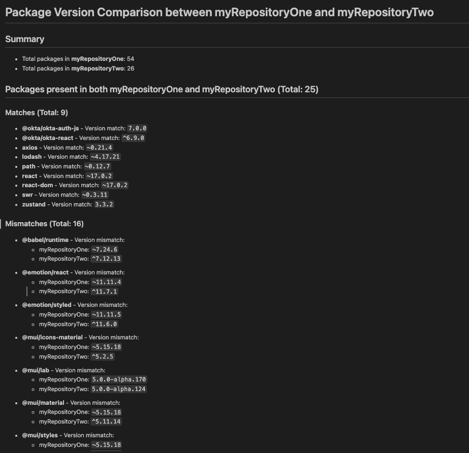
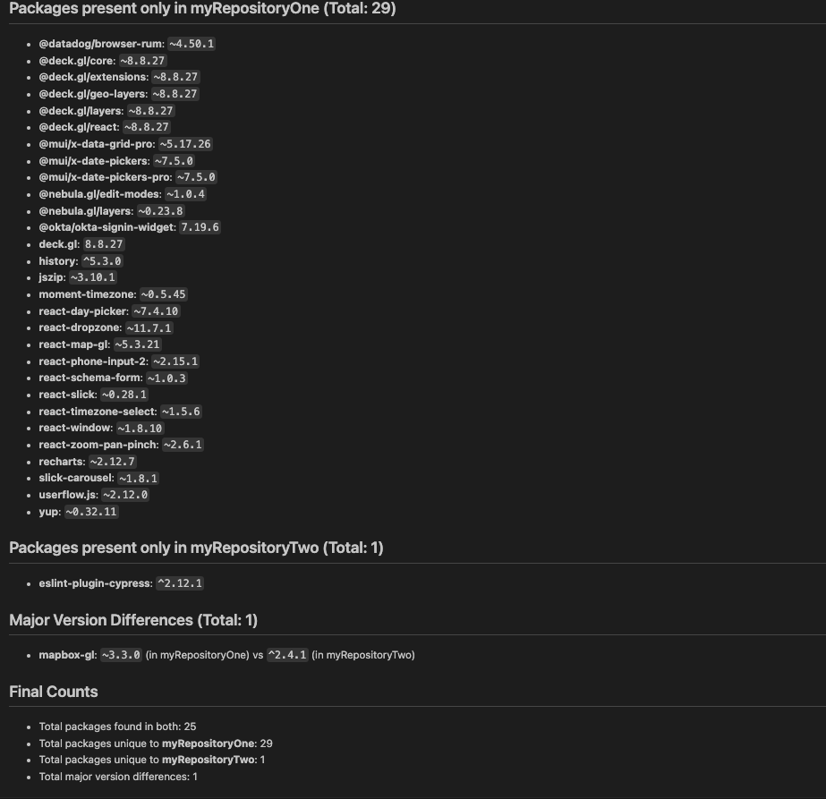

# Package Version Comparison Script

This repository contains a Node.js script that compares the dependencies in two `package.json` files. It highlights version mismatches and lists packages that are unique to each project.

## Features

- **Custom Project Names**: Specify names for the projects being compared.
- **Sectioned Output**: Organized output that clearly differentiates between:

  - Packages present in both projects (with version comparisons)
  - Packages only in the first project
  - Packages only in the second project

    Example report (markdown):

    
    

## Prerequisites

- [Node.js](https://nodejs.org/) installed on your machine.

## Getting Started

1. **Clone the Repository into the same folder as your other repos**

   ```bash
   npm install -g package-comparer
   ```

   Your repos folder would look like (name of repos folder doesn't matter):

   ```bash
   repos
   - repository_1
   - repository_2
   - repository_3
   ...
   ```

2. **Run script with repository names**

Open a terminal in the repos directory (it must be similar structure to the above)

```bash
 compare-packages repository_1 repository_2
```

You can view the generated markdown in "comparison-results.md"
